## 절약 경쟁 기반 가계부 플랫폼
---
 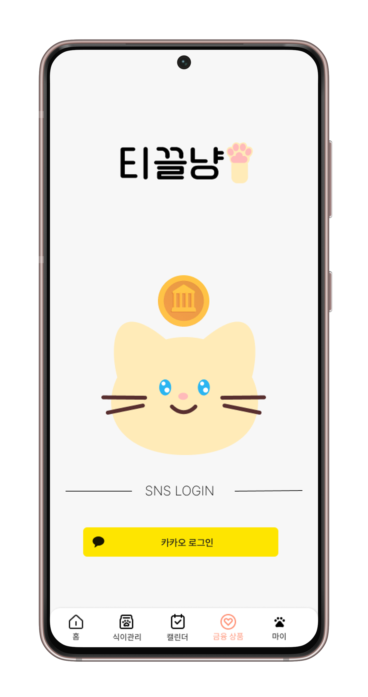

### 🎯 프로젝트 소개
---
사용자  소비내역을 기반으로 챌린지를 생성해서 소비습관을 개선하는 웹 플랫폼

### ✨ 프로젝트 기간
2025.03.03~2025.04.11 (6주)

### 👥 협업 링크

https://www.notion.so/C107-1a5385e273058098a39ada169e7d648a

### 🙌 팀원 소개

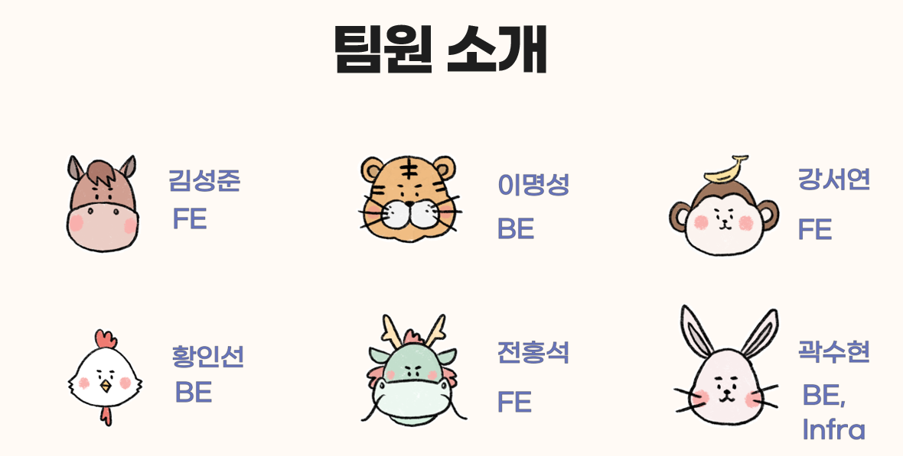

### 🛠 기술 스택
---

FrontEnd

  
  
  
  
  

BackEnd

  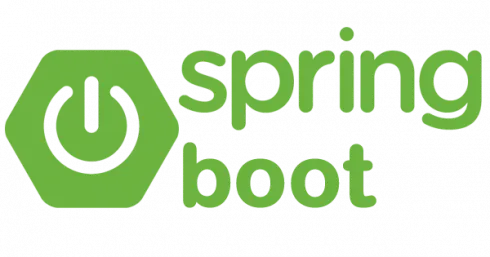
  
  

Infra

  
  
  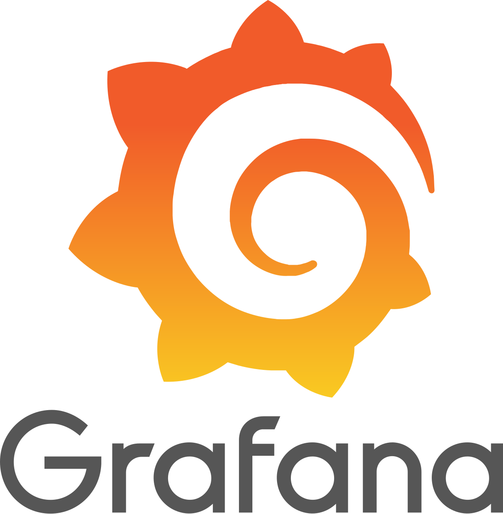
  

### 📚 아키텍처

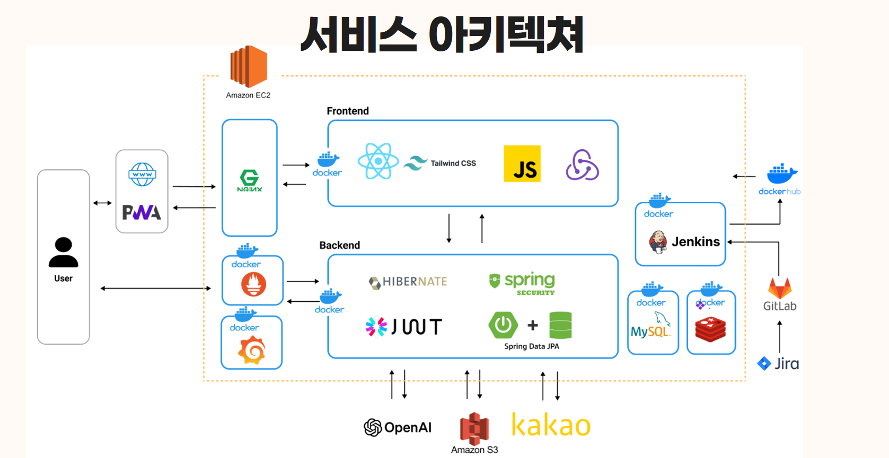

### 기능
---

#### 지출 확인

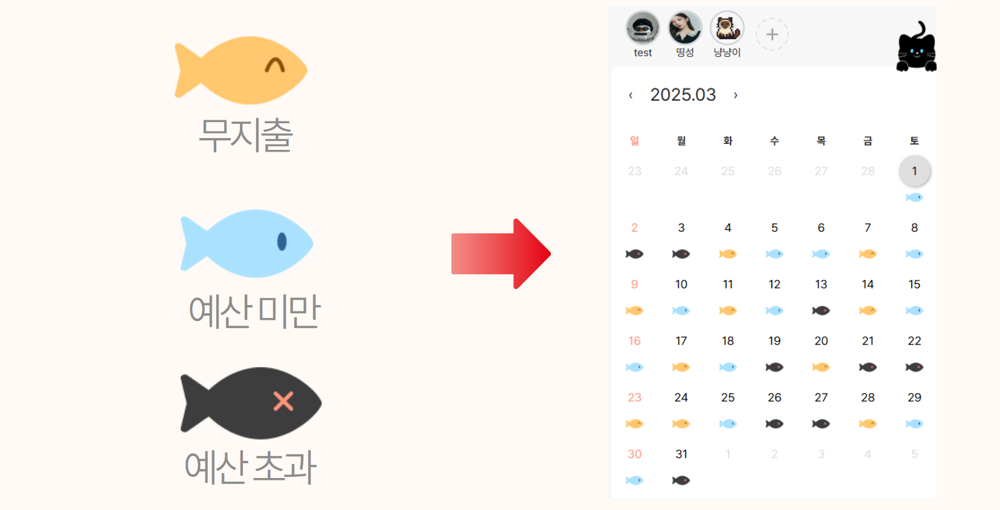

### 챌린지

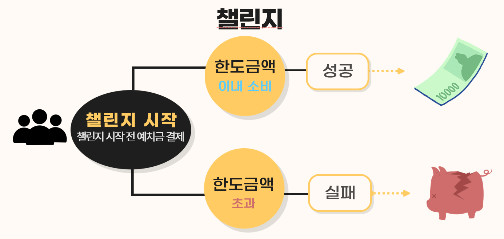

### 버킷 리스트

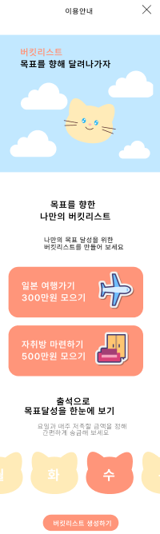

  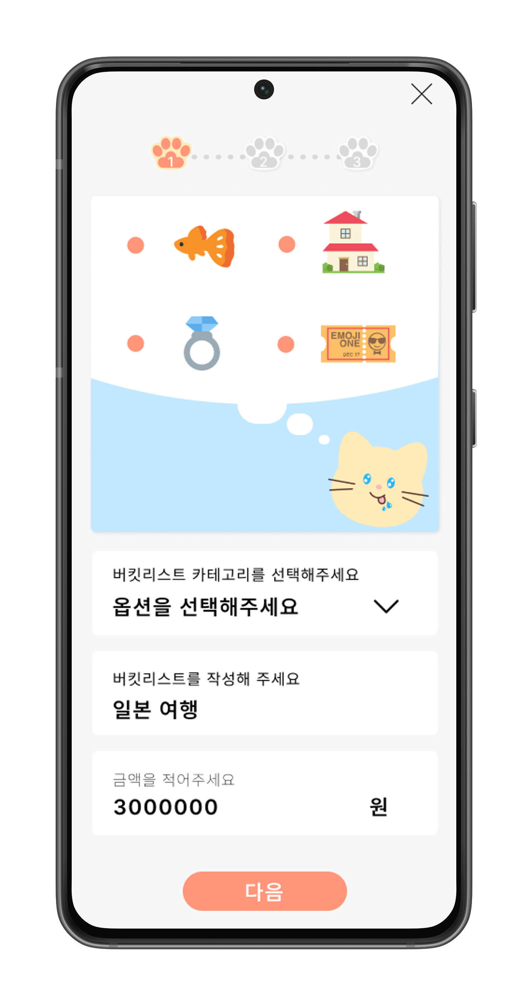
  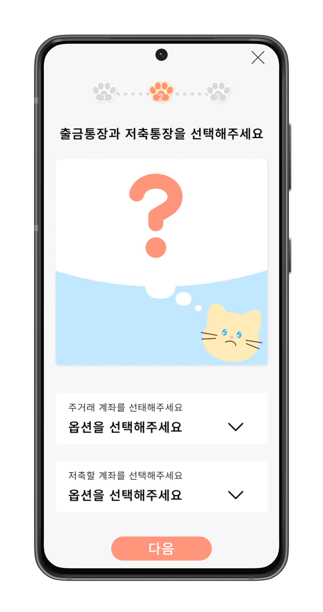
  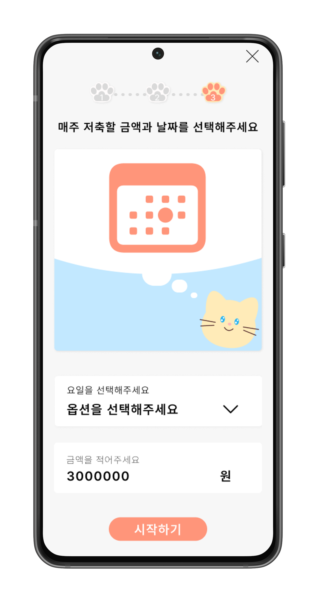

### 카드 추천

## 소개 영상

<video width="320" height="240" controls>
  <source src="assets/intro.mp4" type="video/mp4">
  Your browser does not support the video tag.
</video>
