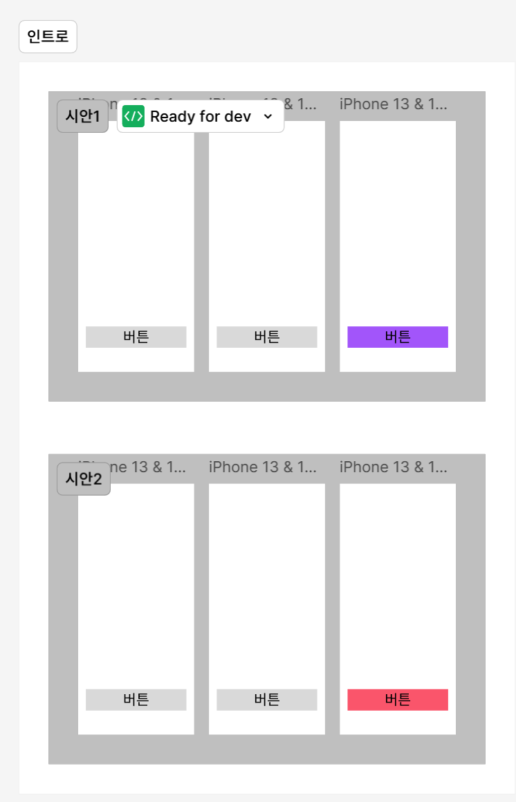

## 공부한 내용

### 1. 피그마 강의 수강

- 오토레이아웃, 그리드 공부
- 피그마 full, hug, fit 공부
- 토글 기능 공부

### 2. react 강의 수강

- 컴포넌트 생성 공부
- 리액트 파일 구조 공부

### 3. 프로젝트 기획

- 노션 생성
  

- 레퍼런스 조사
  
  

- FE: 캐릭터 기획
  

- FE : 목업
  
